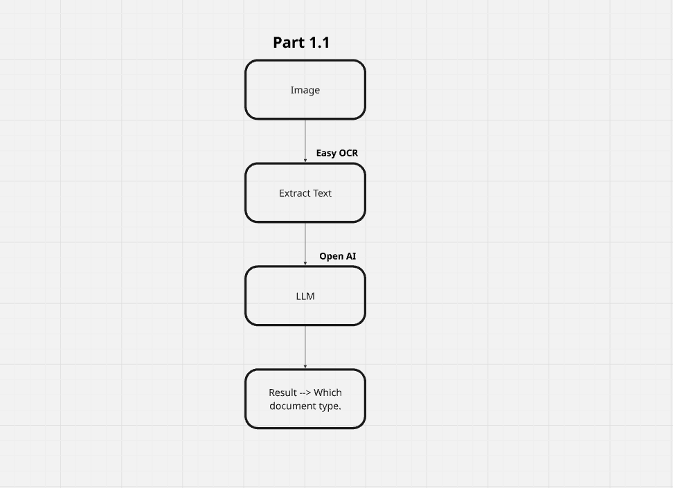
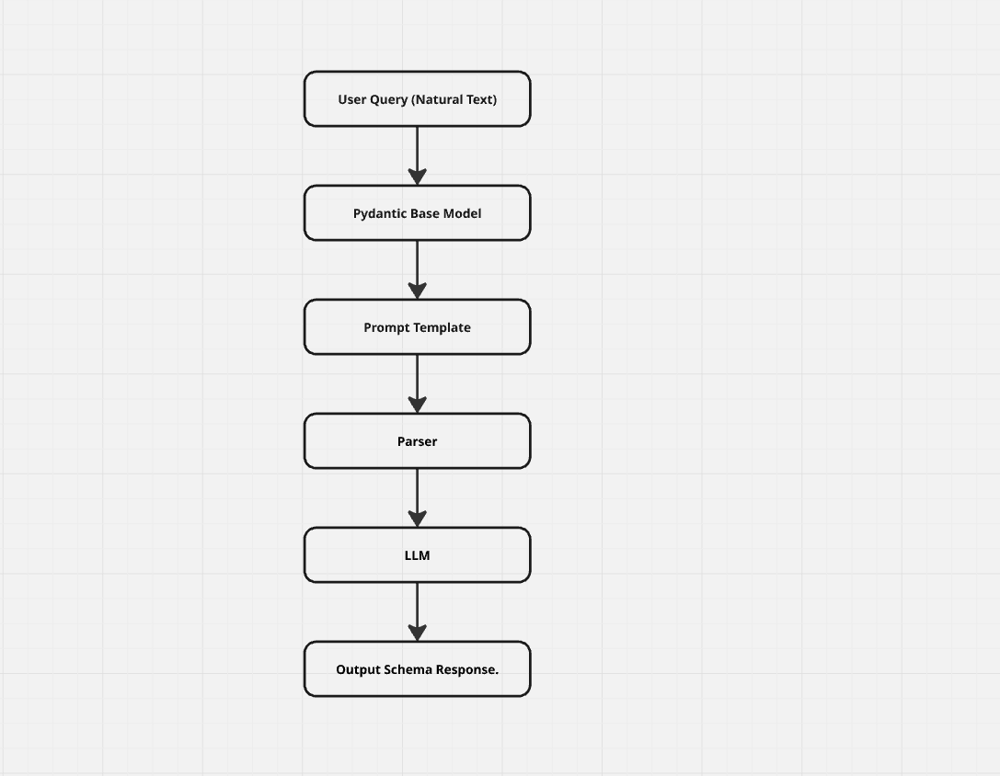
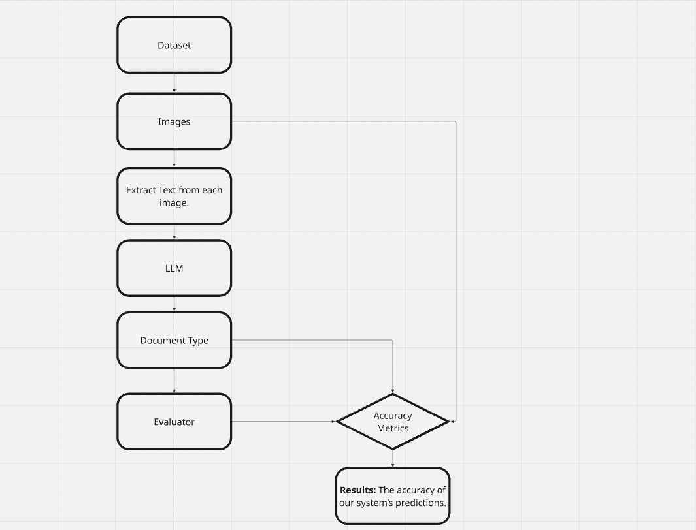

# N-Assignment-AI Documentation

## Overview

This project implements an AI-powered document processing system with three core functionalities:
1. **Document Classification** - Identify document types from images
2. **Data Extraction** - Extract structured information based on schemas
3. **Accuracy Evaluation** - Measure and validate classification performance

---

## 1. Document Classification (`test_classifier.py`)

### Purpose
Automatically classify document types from image inputs using AI vision capabilities.

### How It Works
The classifier analyzes document images and determines their type.

**Flow Diagram:**


### Usage
```bash
python test_classifier.py
```

### Key Features
- Processes image files
- Returns document type classification
- Uses OpenAI Vision API for intelligent analysis
- Fast and accurate classification

---

## 2. Data Extraction (`test_extraction_schema.py`)

### Purpose
Extract structured data from documents and organize it according to a predefined schema.

### How It Works
Once a document is classified, this module extracts specific fields and information based on the document's schema.

**Flow Diagram:**


### Usage
```bash
python test_extraction_schema.py
```

### Key Features
- Schema-based extraction
- Structured output (JSON format)
- Handles multiple document types
- Preserves data relationships

---

## 3. Accuracy Evaluation (`test_evaluator.py`)

### Purpose
Validate and measure the accuracy of document classification and extraction processes.

### How It Works
This module compares the AI-generated classifications and extractions against ground truth data to calculate accuracy metrics and identify areas for improvement.

**Flow Diagram:**


### Usage
```bash
python test_evaluator.py
```

### Key Features
- Calculates precision, recall, and F1-score
- Generates detailed accuracy reports
- Identifies misclassified documents
- Provides performance insights


## Quick Reference

| Script | Purpose | Input | Output |
|--------|---------|-------|--------|
| `test_classifier.py` | Classify document type | Image file | Document type + confidence |
| `test_extraction_schema.py` | Extract structured data | Classified image | JSON with extracted fields |
| `test_evaluator.py` | Measure accuracy | Test dataset | Accuracy metrics & report |

---

## Next Steps

1. Start with `test_classifier.py` to understand document classification
2. Use `test_extraction_schema.py` to extract specific data
3. Run `test_evaluator.py` to validate your results
4. Review the flowcharts (part-1.1.png, part-2.1.png, part-1.2.png) for detailed process flows
